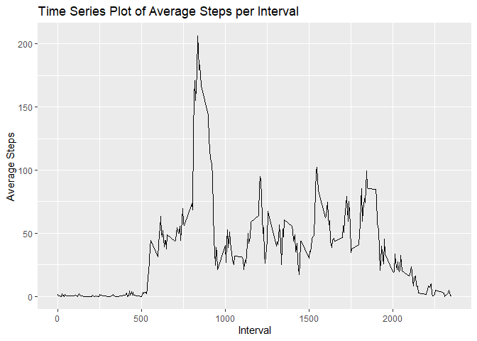

## Loading and preprocessing the data

```r
# Load libraries
library(dplyr)
```

```
## Warning: パッケージ 'dplyr' はバージョン 4.3.2 の R の下で造られました
```

```
## 
##  次のパッケージを付け加えます: 'dplyr'
```

```
##  以下のオブジェクトは 'package:stats' からマスクされています:
## 
##     filter, lag
```

```
##  以下のオブジェクトは 'package:base' からマスクされています:
## 
##     intersect, setdiff, setequal, union
```

```r
# Load the data
unzip("activity.zip")
data <- read.csv("activity.csv")

# Change the format of the date
data$date <- as.Date(data$date)


## What is the mean total number of steps taken per day?
library(ggplot2)
library(dplyr)

# Calculate total steps per day
daily_steps <- data %>%
  group_by(date) %>%
  summarize(total_steps = sum(steps, na.rm = TRUE))

# Create a histogram
ggplot(daily_steps, aes(x = total_steps)) +
  geom_histogram(binwidth = 1000, fill = "blue", color = "black") +
  labs(title = "Histogram of Total Daily Steps", x = "Total Steps", y = "Frequency")
```

<!-- -->

```r
# Calculate mean and median
mean_steps <- mean(daily_steps$total_steps)
median_steps <- median(daily_steps$total_steps)

# Display results
print(paste("Average daily steps:", mean_steps))
```

```
## [1] "Average daily steps: 9354.22950819672"
```

```r
print(paste("Median daily steps:", median_steps))
```

```
## [1] "Median daily steps: 10395"
```

```r
## What is the average daily activity pattern?
library(ggplot2)
library(dplyr)

# Calculate average steps per interval
interval_avg <- data %>%
  group_by(interval) %>%
  summarize(average_steps = mean(steps, na.rm = TRUE))

# Create a time series plot
ggplot(interval_avg, aes(x = interval, y = average_steps)) +
  geom_line() +
  labs(title = "Time Series Plot of Average Steps per Interval", 
       x = "Interval", 
       y = "Average Steps")
```

<!-- -->

```r
# Identify the interval with maximum average steps
max_interval <- interval_avg[which.max(interval_avg$average_steps), ]

# Display results
print(paste("Interval with maximum average steps:", max_interval$interval))
```

```
## [1] "Interval with maximum average steps: 835"
```

```r
## Imputing missing values
# Calculate the number of missing values
missing_values <- sum(is.na(data$steps))
print(paste("Total missing values:", missing_values))
```

```
## [1] "Total missing values: 2304"
```

```r
# Calculate average steps for each interval
interval_means <- data %>%
  group_by(interval) %>%
  summarize(mean_steps = mean(steps, na.rm = TRUE))

# Impute missing values with the average steps for each interval
data_imputed <- data
for (i in 1:nrow(data_imputed)) {
  if (is.na(data_imputed$steps[i])) {
    data_imputed$steps[i] <- interval_means$mean_steps[which(interval_means$interval == data_imputed$interval[i])]
  }
}

# Calculate total steps per day
daily_steps_imputed <- data_imputed %>%
  group_by(date) %>%
  summarize(total_steps = sum(steps))

# Create a histogram
ggplot(daily_steps_imputed, aes(x = total_steps)) +
  geom_histogram(binwidth = 1000, fill = "blue", color = "black") +
  labs(title = "Histogram of Total Daily Steps (Imputed Data)", x = "Total Steps", y = "Frequency")
```

<!-- -->

```r
# Calculate mean and median
mean_steps_imputed <- mean(daily_steps_imputed$total_steps)
median_steps_imputed <- median(daily_steps_imputed$total_steps)

# Display results
print(paste("Average daily steps (imputed):", mean_steps_imputed))
```

```
## [1] "Average daily steps (imputed): 10766.1886792453"
```

```r
print(paste("Median daily steps (imputed):", median_steps_imputed))
```

```
## [1] "Median daily steps (imputed): 10766.1886792453"
```

```r
## Are there differences in activity patterns between weekdays and weekends?
library(dplyr)
library(ggplot2)
library(lubridate)
```

```
## 
##  次のパッケージを付け加えます: 'lubridate'
```

```
##  以下のオブジェクトは 'package:base' からマスクされています:
## 
##     date, intersect, setdiff, union
```

```r
# Use the dataset with imputed missing values
# Example: data_imputed <- ...

# Add 'weekday' or 'weekend' column to the data
data_imputed$date <- as.Date(data_imputed$date)
data_imputed$day_type <- ifelse(weekdays(data_imputed$date) %in% c("Saturday", "Sunday"), "weekend", "weekday")
data_imputed$day_type <- as.factor(data_imputed$day_type)

# Calculate average steps for weekdays and weekends
interval_avg <- data_imputed %>%
  group_by(interval, day_type) %>%
  summarize(average_steps = mean(steps, na.rm = TRUE))
```

```
## `summarise()` has grouped output by 'interval'. You can override using the
## `.groups` argument.
```

```r
# Create a time series plot
ggplot(interval_avg, aes(x = interval, y = average_steps, color = day_type)) +
  geom_line() +
  facet_wrap(~ day_type, scales = "free_y") +
  labs(title = "Average Steps per Interval by Day Type", 
       x = "Interval", 
       y = "Average Steps",
       color = "Day Type") +
  theme_minimal()
```

<!-- -->
